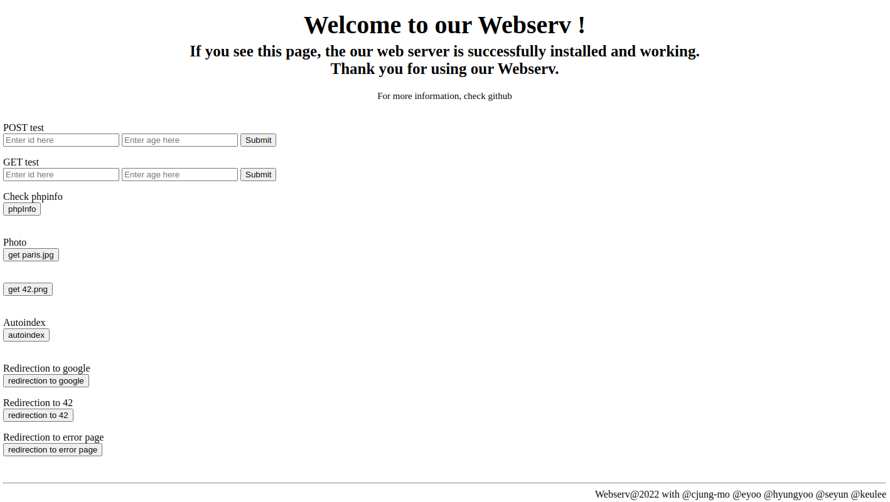

# Webserv

- 42 Project with C++(98). This project implements a simple web server based on HTTP/1.1 protocol.
- We tried to implement a web server similar to `nginx` as much as possible. You can test `GET`, `POST`, and `DELETE` methods. The server provoides static web page and dynamic pages with CGI(PHP). The Configuration file is inspired by Nginx format and the server contorls event management with `Epoll Socket I/O`.
 
### 📝 PDF
[Webserv 42 Project PDF (2022, EN)](https://github.com/keulee/Webserv/en.subject.pdf)

### ⚙️ How to build

You can run on Linux OS (used Epoll)
```
$> make
$> ./webserv [configuration file]

ex) ./webserv config/conf/sample.conf
```

* You have the option to run without a configuration file, which will automatically set the default configuration file.
* Verify that you have `php` and `php-cgi` with the `correct path`. If not, it won't operate correctly.


### Demo Page

After building, you can check a local demo page on **http://localhost:8080**



- Localhost port number can be changed with test configuration file and your configuration.
- You can test easily `POST`, `GET` method with this demo page.
- We advise you to test `DELETE` method using `telnet` on a terminal. Make sure to first `create a test file` on the path var/www/html/ to test DELETE method.
- Example for DELETE
```
>> telnet localhost [PORT_NUMBER]
> DELETE [FILE_PATH/FILE_NAME] HTTP/1.1
> Host: localhost
```

### 🚩Team

<p>
    <a href="https://profile.intra.42.fr/users/cjung-mo"></a> <a href="https://github.com/jmcheon"></a>
  <br>
    <a href="https://profile.intra.42.fr/users/eyoo"></a> <a href="https://github.com/EunmiYoo"></a>
   <br>
    <a href="https://profile.intra.42.fr/users/hyungyoo"></a> <a href="https://github.com/hyungyoo"></a>
  <br>
    <a href="https://profile.intra.42.fr/users/seyun"></a> <a href="https://github.com/zeroet"></a>
  <br>
    <a href="https://profile.intra.42.fr/users/keulee"></a> <a href="https://github.com/keulee"></a>
  <br>
</p>
